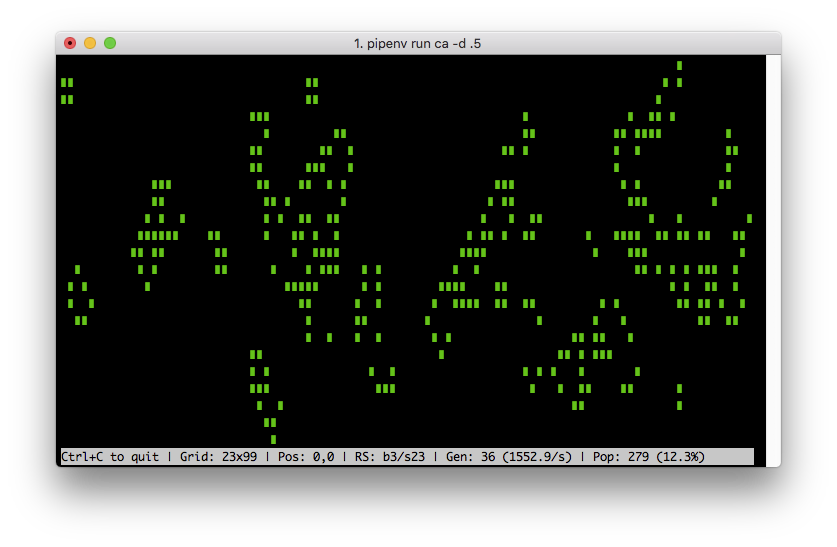

# Cellular Automata

Simple 2D [cellular automata](https://www.conwaylife.com/wiki/Cellular_automaton) implementation with fun visualizations for your terminal

## Features

- The default automaton is [Conway's Game of Life](https://www.conwaylife.com/wiki/Conway%27s_Game_of_Life), but [many other automata](https://www.conwaylife.com/wiki/List_of_Life-like_cellular_automata) with different [rules](https://www.conwaylife.com/wiki/Rulestring) are supported (using the standard [Moore neighborhood](https://www.conwaylife.com/wiki/Moore_neighbourhood)).
- By default, the size of the universe will be equal to the dimensions of the terminal window. When the universe is bigger than the terminal window, the arrow/WASD keys can be used to adjust the viewport. Hold `Shift` to scroll a page at a time in any direction and use `Home` to return to the default position.
- Use the `+` and `-` keys to control the speed of the simulation.
- Support for closed and wrapped universe topologies.
- Themes!

## Getting Started

    poetry install
    poetry shell
    ...

## Run Tests

    pytest

## Run Simulation

Use `--help` to see available options:

    ca
